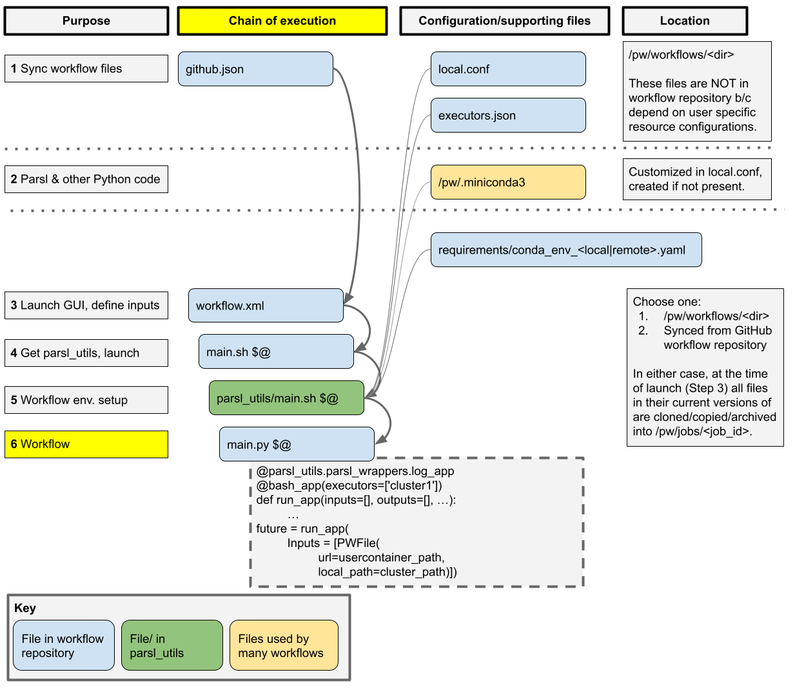

# Parsl Utils
This repository contains wrapper scripts to run Parsl workflows in cluster pools on the PW platform. Its goal is to enable the user to focus on the Parsl code by taking care of all the integration aspects such as creating SSH tunnels or installing conda packages. 

The best way to use this repository is to look at the [parallelworks/simple_parsl_demo](https://github.com/parallelworks/simple_parsl_demo) example. Below is a schematic for how the `parsl_utils` are integrated into a PW workflow. 

## 1. Workflow Script
The Parsl workflow is defined in the `main.py` script.

## 2. Workflow Apps
Optionally, the parsl apps can be defined in file workflow_apps.py. To run an app in a given executor (PW resource) use the executors input to the parsl app decorator to indicate the executor label. The example below shows how to run a Parsl bash_app in the executor labelled `myexecutor_1`.

```
@bash_app(executors=['myexecutor_1'])
```

## 3. Running Parsl Utils
Clone the parsl_utils repository at runtime in a subdirectory and execute the wrapper script passing it all the workflow arguments. 

```
#!/bin/bash
set -x
# Clone respository. Using submodules will not clone the latest version.
branch=main
rm -rf parsl_utils
git clone -b ${branch} https://github.com/parallelworks/parsl_utils.git parsl_utils
# Call the wrapper script. Can't run a scripts inside parsl_utils directly (PW issue)
bash parsl_utils/main.sh $@
```

## 4. Local Configuration
Use file `local.conf` to define the conda environment in the user container (local conda environment). An example is shown below with the following keywords:

- CONDA_ENV: Name of the conda environment to activate in the user container before running `main.py`.
- CONDA_DIR: Path to the conda install directory.
- INSTALL_CONDA: Can take the values true or false to install the conda environment (true) or only activate it (false).
- LOCAL_CONDA_YAML: Path to the YAML file defining the conda environment (conda env export) to install it if INSTALL_CONDA=true


```
CONDA_ENV=parsl-1.2
CONDA_DIR=/pw/.miniconda3
INSTALL_CONDA=false
LOCAL_CONDA_YAML=./requirements/conda_env_local.yaml
```
## 5. Executors Definition
Use file `executors.json` to define the executor parameters for each executor. These parameters are used to define the Parsl configuration object and by the wrapper scripts to prepare and clean resources. The executor labels are the top level keys in the JSON file and the executor parameter names and values are the nested keys and values as shown in the example below:

```
{
  "myexecutor_1": {
    "RESOURCE": "gcpv2",
    "CONDA_ENV": "parsl-1.2",
    "CONDA_DIR": "__POOLWORKDIR__/pw/miniconda",
    "INSTALL_CONDA": "true",
    "LOCAL_CONDA_YAML": "./requirements/conda_env_remote.yaml",
    "CORES_PER_WORKER": 0.1
  },
  "myexecutor_2": {
    "POOL": "awsv2",
    "CONDA_ENV": "parsl-1.2",
    "CONDA_DIR": "__POOLWORKDIR__/pw/miniconda",
    "CORES_PER_WORKER": 0.1,
    "SlurmProvider": {
      "partition": "compute",
      "nodes_per_block": 1,
      "cores_per_node": 4,
      "min_blocks": 0,
      "max_blocks": 10,
      "walltime": "01:00:00"
    },
    "myexecutor_3": {
      ...
     }
  }
}
```

**Required Executor Parameters**:
- POOL: Name of the PW resource corresponding to the executor label. 
- CONDA_ENV: Name of the conda environment to activate in the executor.
- CONDA_DIR: Path to the conda install directory.


**Optional Executor Parameters**:
- CORES_PER_WORKER: Cores per worker in [HighThroughputExecutor](https://parsl.readthedocs.io/en/stable/stubs/parsl.executors.HighThroughputExecutor.html). The default value is 1. 
- INSTALL_CONDA: Can take the values true or false to install the conda environment (true) or only activate it (false).
- LOCAL_CONDA_YAML: Path to the YAML file defining the conda environment (conda env export) to install it if INSTALL_CONDA=true
- SlurmProvider or PBSProProvider: A dictionary in the format above with the name of the Parsl provider object ([SlurmProvider](https://parsl.readthedocs.io/en/stable/stubs/parsl.providers.SlurmProvider.html) or [PBSProProvider](https://parsl.readthedocs.io/en/stable/stubs/parsl.providers.PBSProProvider.html)) and the parameters to initialize the object. Make sure these parameters are of the right type (e.g.: nodes_per_block must be an integer). The default provider is [LocalProvider](https://parsl.readthedocs.io/en/stable/stubs/parsl.providers.LocalProvider.html). 

**Advanced Executor Parameters**:
TODO

## 6. Parsl Configuration
To use the general parsl configuration object provided in this repository add the following lines to the `main.py`:

```
import parsl_utils
from parsl_utils.config import config, exec_conf
# OTHER IMPORTS
parsl.load(config)
```

This object is initialized using the information in the `executors.json` file.

## 7. Data Provider
TODO


